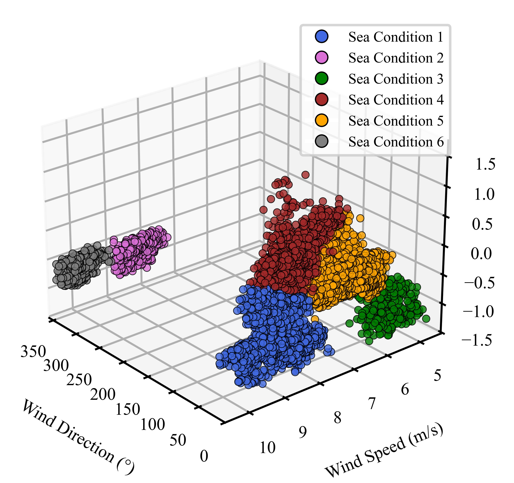

# voyage segmentation based on K-means algorithm
## AwesomeProject
This project uses the navigation data of a bulk carrier to divide the ship's navigation segments using the K-means algorithm, providing a solution for optimizing the ship's energy efficiency by reasonably reducing the optimization frequency and considering the impact of sea conditions on energy consumption.
## Features
- ✅ Provide a dataset of bulk carrier voyage data for open-source use.
- ✅ Classify sea conditions based on wind direction, wind speed, and current velocity from the voyage data.
  

- ✅ Determine the optimal number of clusters using the elbow method.
- ✅ Segment the vessel’s voyage based on the established sea condition classification.
## Data
The data was collected from sensors on the ocean-going training vessel Yuming, affiliated with Shanghai Maritime University, IMO: 9613886.
## Structure
The root folder contains the following subfolders and files.
- **data:** This folder contains raw, interim and processed datasets used in this project, in csv format.
- **data_index.py:** The code loads a CSV file, cleans and renames columns, standardizes the time format, and saves the processed data to a new CSV file.
- **data_processing.py:** The code processes a dataset by standardizing latitude/longitude, converting units, filtering out abnormal values, removing unnecessary columns, reordering columns, and saving the final data to a new CSV file.
- **determine_the_number_of_clusters.py:** The code uses the Elbow method to determine the optimal number of clusters for KMeans clustering and plots the relationship between SSE and the number of clusters.
- **sea_condition_clustering.py:** The code performs K-Means clustering to divide the data into 6 sea condition categories and plots 3D scatter plots with cluster labels and cluster centers.
- **voyage_segmentation.py:** The code segments the voyage based on sea condition types and displays the ship's trajectory on two maps: one with sea condition classifications and the other without.
## Conclusions
- Achieved basic data processing.
- Used the elbow method to classify sea conditions into six categories.
- Applied the K-means algorithm to divide the vessel's operational conditions into six categories.
- Divided the voyage into eight segments based on the defined sea condition classifications.
## Shortcoming
- Due to the wind direction range being 0-360°, both 0° and 360° represent the same direction (north). However, since the K-means clustering algorithm calculates the distance of data points from the cluster center based on Euclidean distance, it inadvertently amplifies the difference between 0° and 360°, leading to an unreasonable calculation of SSE (Sum of Squared Errors). This, in turn, affects the determination of the optimal number of clusters.
- It can be observed from the segmentation results of the voyage_segmentation.py file that some segments are mixed with different sea conditions, which increases the complexity of segmentation.
## Attention
- To address the first issue mentioned in the above shortcomings, this project, when using the elbow method to determine the optimal number of clusters, ignores the sharp drop in SSE caused by the transition from 360° to 0° in wind direction (i.e., the change between K=2 and K=3). The choice of K=6 as the number of clusters was based on the subjective judgment of the project owner and may not be entirely reasonable. If there are suggestions for improvement, we welcome participation in the extension and modification of this project or contact with the author.
- To address the second issue mentioned in the above shortcomings, delete certain data points from different sea conditions based on their proportion in the voyage. The deleted data is saved in the file 05-YuMing_final_processed_with_clusters.CSV located in the data folder.
## Contact Details
- Email: xinyuezhang1117@163.com
- Wechat： awordzxy

